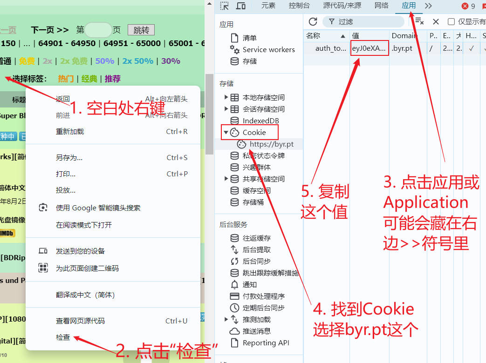
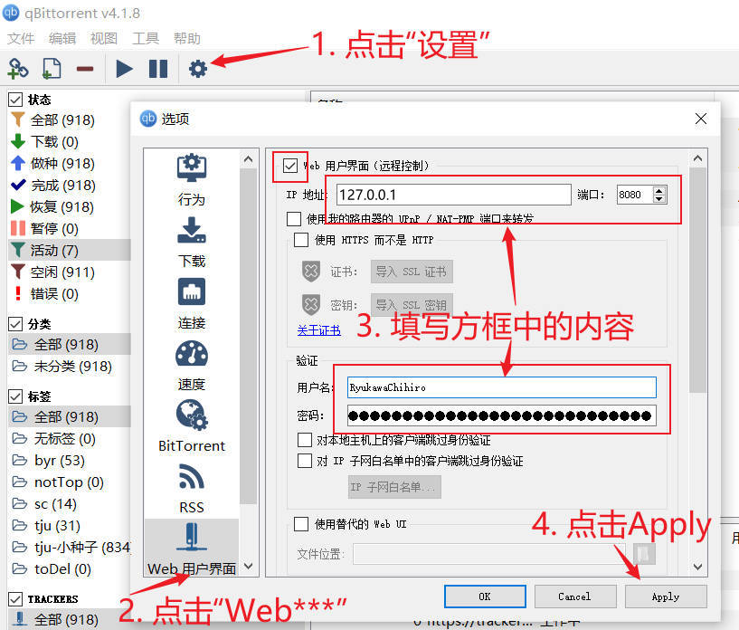

<!--
 * @Author: LetMeFly
 * @Date: 2024-08-07 12:13:14
 * @LastEditors: LetMeFly
 * @LastEditTime: 2024-08-09 16:52:53
-->


# BYRBT_RyukawaChihiro

流川千寻(Ryukawa Chihiro) - [BRYBT](https://byr.pt)小小刷流姬 - 只会下载(和删除)首页Top且Free的种子。

## 前言

<details><summary>BYRBT是什么？</summary>

大概就是一个<i>只有教育网/外网的ipv6可以访问</i>的种子网站，里面有很多ZiYuan。

</details>

<details><summary>为什么要刷流？</summary>

<ol>
<li>有上传量才能愉快地下载；</li>
<li>上传量达4T可永久保留账号；</li>
<li>看着上传量蹭蹭往上涨，それでいい。</li>
</ol>

</details>

<details><summary>为何重造轮子？</summary>

<p><b>最初</b>是想起来的时候手动刷新一下看看有没有新的top且free的种子，<b>后面</b>写了个小爬虫每121秒帮我看一次新种子，<b>后面</b>懒得手动增删种子了决定交给<i>流川千寻</i>来完成。</p>

所以<i>流川千寻</i>是一只简单纯粹的佛系刷流姬。

</details>

<details><summary>为什么起这个名字？</summary>

因为<del>我想(bushi</del>

</details>

## 如何使用

1. 环境准备：
    
    1. 安装好Python：[python.org](https://www.python.org/downloads/)直接下载无脑安装即可
    2. 下载[源代码](https://github.com/LetMeFly666/BYRBT_RyukawaChihiro/archive/refs/heads/master.zip)
    3. 安装[qBittorrent](https://www.fosshub.com/qBittorrent.html?dwl=qbittorrent_4.6.5_x64_setup.exe)（当前支持≥v4.1.x，低版本可能有部分api无法得到完全支持，推荐v4.6.5）

2. 登录BYRBT，获取你的cookie：

    

3. 登录BYRBT，获取你的passkey：
    
    访问[`https://byr.pt/usercp.php`](https://byr.pt/usercp.php)，找到`passkey`并将后面的一串值复制

    

4. 开启BT客户端的Web用户界面，以qBittorrent为例(当前仅支持这一个客户端)：

    如果按图示设置ip则`client_ip`可以为`http://127.0.0.1:8080`

    

5. 在`config`目录下新建文件`secret.py`，输入以下内容（可参考[配置说明](#配置说明)部分进行配置）：
    
    ```python
    cookie = 'eyJ0eXA...第2步获取到的值'
    passkey = '第3步获取到的值'
    client_ip = 'http://127.0.0.1:8080'  # 被控制的客户端的web ip
    client_username = 'RyukawaChihiro'   # bt客户端web的用户名
    client_password = '666'              # bt客户端web的密码
    maxDiskUsage = 525.25                # 最大磁盘空间使用量(单位GB)
    savePath = ''                        # 【可选】默认保存路径
    refreshTime = 121                    # 【可选】种子刷新间隔
    ```

6. 执行命令`python main.py`，开始愉快地刷流吧。

## 配置说明

|参数|类型|描述|举例|
|:--:|:--:|:--:|:--:|
|`cookie`|string|byrpt网页端的cookie，可参考[如何使用](#如何使用)第2步获取|`'eyJ0eXA45454jkjsiu2o30u2ohskjfklsjfklj...'`|
|`passkey`|string|byrpt账号passkey，可参考[如何使用](#如何使用)第3步获取|`'ljkjeijoi0999887398798u2uj3ijl'`|
|`client_ip`|string|qBittorrent客户端web ui的地址，可参考[如何使用](#如何使用)第4步进行配置|`'http://127.0.0.1:8080'`|
|`client_username`|string|qBittorrent客户端web ui的用户名，可参考[如何使用](#如何使用)第4步进行配置|`'RyukawaChihiro'`|
|`client_password`|string|qBittorrent客户端web ui的密码，可参考[如何使用](#如何使用)第4步进行配置|`'666'`|
|`maxDiskUsage`|float|为TopFree的种子预留的最大空间（超过此空间的种子将依据一定的策略进行下载或增删），单位GB|`525.25`|
|`savePath`*optional*|string|文件要保存到的位置。若不选，则将保存在客户端中设置的默认位置|`''`|
|`refreshTime`*optional*|integer|每隔多长时间查询一次是否有新种子，单位秒。若不选，则默认121s访问一次byrpt|`121`|

## 运行逻辑

### 标签判定

流川千寻会对种子打上如下标签：

1. `sc`：所有的TopFree的（或流川千寻工作期间TopFree过的）种子都会被打上`sc`标签。这些种子将会被认为不是长期做种的种子，可能会随着过期策略被删除。
2. `toDel`：在TopFree过的种子中，由于免费时长到期等原因，已经不是TopFree的种子。这些种子将优先被删除。

### 种子判定

[种子判定](#种子判定)每隔`refreshTime`秒进行一次。

判定时访问一次byrpt，返回所有的TopFree种子，包括：种子id、free剩余时长、种子大小、做种者数、下载者数、种子hash。

依据TopFree种子的hash，筛选客户端中的种子。对客户端中所有已经存在的TopFree的种子打一次`sc`标签。

之后筛选客户端中所有具有`sc`标签的种子。如果已经不在TopFree中，则将被打上`toDel`标签。对于所有具有`sc`标签的种子，统计总磁盘占用。

若有TopFree的种子还未下载，则进入[种子下载](#种子下载)。

### 种子下载

对所有待下载的种子，执行下面操作：

```python
当前磁盘总占用, 需下载种子, 具有sc标签的种子 = 种子判定()
具有sc标签的种子.sortBy(种子添加时间)  # 下载较早的种子优先
for seed in 需下载种子:
    tryToDownload(seed)

def tryToDownload(seed):
    if maxDiskUsage - 当前磁盘总占用 + sum(thisSeed.size for thisSeed in 具有sc标签的种子) < seed.size:
        return  # “最大占用 - 已经使用 + 可释放” 仍然小于待下载种子，放弃下载 | TODO: 此处可有更优策略
    while maxDiskUsage - 当前磁盘总占用 < seed.size and len(具有sc标签的种子):
        这次被删的种子 = 具有sc标签的种子[0]
        具有sc标签的种子 = 具有sc标签的种子[1:]
        当前磁盘总占用 -= 这次被删的种子.size
        控制客户端删除种子(这次被删的种子)
    reallyDownload(seed)

def reallyDownload(seed):
    当前磁盘总占用 += seed.size
    控制客户端下载种子_并_打上sc标签(seed)
```

## 开发文档


## TODO


- [x] 头像：[https://cdn.letmefly.xyz/img/ACG/AIGC/BYRBT_RyukawaChihiro/avatar_00.jpg](https://cdn.letmefly.xyz/img/ACG/AIGC/BYRBT_RyukawaChihiro/avatar_00.jpg)、avatar_01.jpg、avatar_02.jpg、...
- [x] 磁盘空间考虑
- [ ] 种子优先级考虑：下载优先级、上传优先级。emm，挺麻烦的。

## End

+ 仓库地址：[Github@LetMeFly666/BYRBT_RyukawaChihiro](https://github.com/LetMeFly666/BYRBT_RyukawaChihiro)
+ 在线浏览：[RyukawaChihiro.LetMeFly.XYZ](https://ryukawachihiro.letmefly.xyz/)
+ [我的流量条](https://byr.pt/mybar.php?userid=371930&bgpic=3)